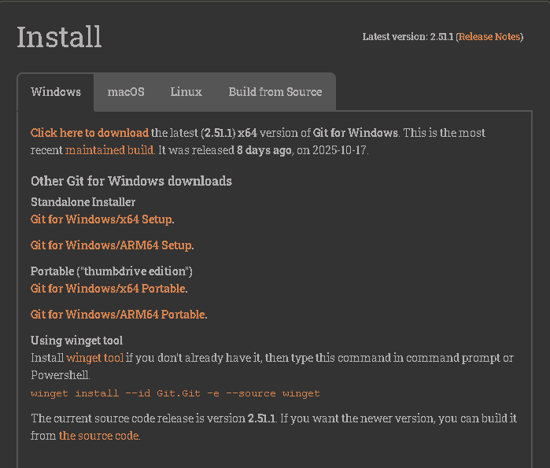
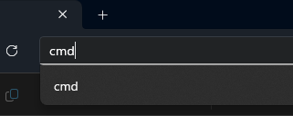
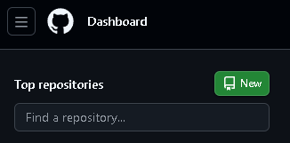

# How to Set Up Git

1. Go to this link (https://git-scm.com).
2. Click Install.

    

3. Download the most appropriate one for your setup.

    

4. Run the installer, then press next until it starts downloading.

---

# How to Set-Up Github and Visual Studio Code

In order to sync your activities from Visual Studio code to your chosen Github repository, follow the steps below:

1. Create a new folder and open it.
2. Click the directory on top of the folder and type "cmd" to open the command prompt on your designed folder.

    

3. Type "code ." in the command promt to open visual studio code.

    

4. Go to your github account and on your home page, click "New" located on top left of your page. Name your repository and click create. Keep the repository public so people can view it.

    

    

5. Back to VS Code. On the bottom right part of VS code, click the drop down bottom beside the "+" icon and click "Git Bash"

    

    

6. For source control purposes, paste each line separately in the terminal. Change the text with "" to your name and email address.

    git config --global user.name "Your Name"

    git config --global user.email "you@youraddress.com"

    git config --global push.default matching

    git config --global alias.co checkout

    git init

7. Now, when you